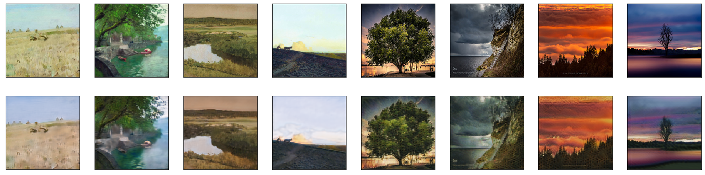
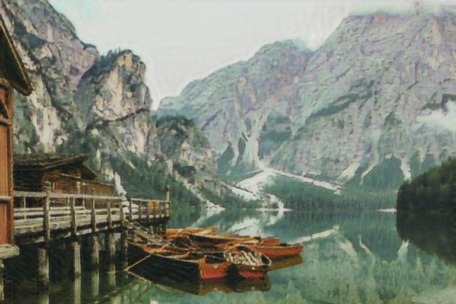
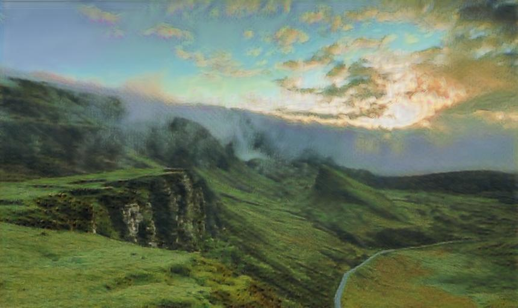
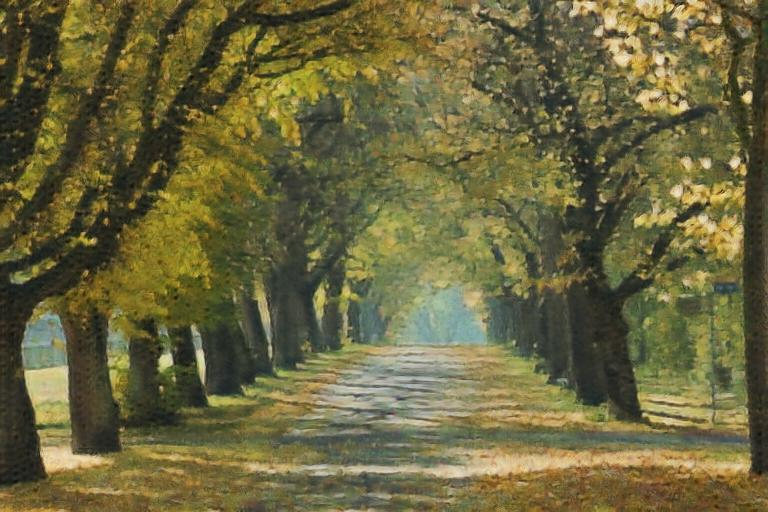

# Генерация изображений
## Deep Learning School. Итоговый проект

### Задача
В качестве задачи выбрано преобразование между картинами Исаака Левитана и фотографиями. Для решения задачи используется архитектура CycleGAN. Картины Левитана получены с wikiart.org, из них отобрано 369 пейзажей, изображения доступны по [ссылке](https://drive.google.com/file/d/1xWBEZHEixhHfq8r4mSIBlUQgdTUUFI5A/view?usp=share_link). Второй набор изображений - фотографии - взят из датасета [monet2photo](https://www.kaggle.com/balraj98/monet2photo).

CycleGAN реализован согласно описаниям в [оригинальной статье](https://arxiv.org/abs/1703.10593) и обучен по рекомендациям оттуда же. Подробности обучения доступны в ipynb в соответствующей [директории](./notebooks). Итоговые модели (а также неудачные варианты задач) доступны по [ссылке](https://drive.google.com/drive/folders/1BOUIr0E9oCnuIFYmpFEoJd4VYYTcxNL2?usp=sharing).

### Результаты
Результаты, полученные на изображениях из используемых датасетов (верхний ряд - реальные изображения, нижний - результат генерации):

Результаты преобразования различных фотографий в картины:

### Генерация
Генерация изображений доступна в двух местах:
* Веб-версия - [https://iktovr.github.io/photo2levitan/](https://iktovr.github.io/photo2levitan/) - генерирует изображения размера 256x256
* Телеграм бот - [@photo2levitan_bot](https://t.me/photo2levitan_bot) - поддерживает изображения любого размера, но приводит их к размеру 512 по меньшей стороне

<!-- Подробности реализации описаны в соответствующих ветках -->